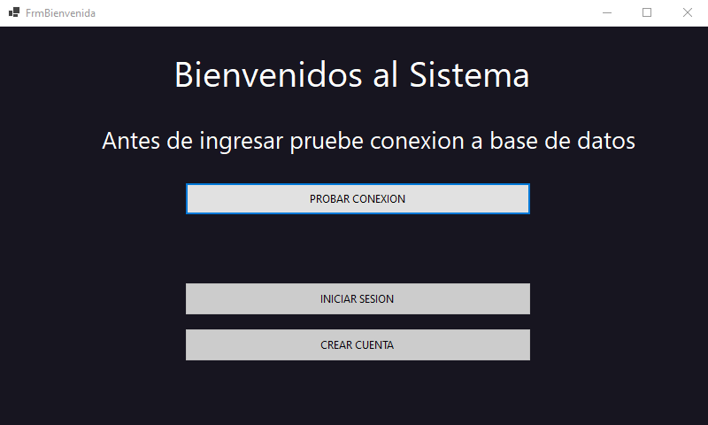
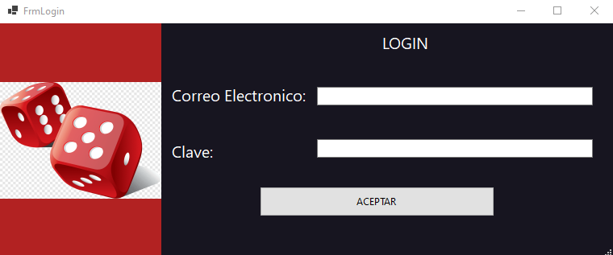
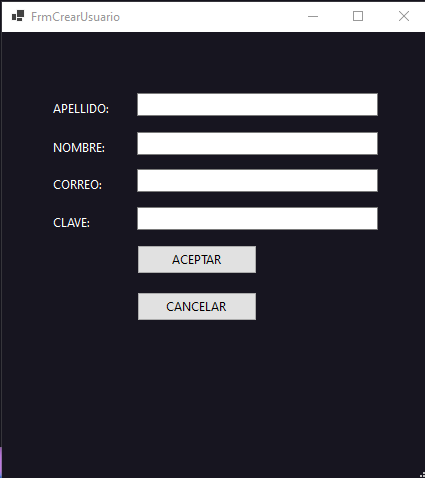
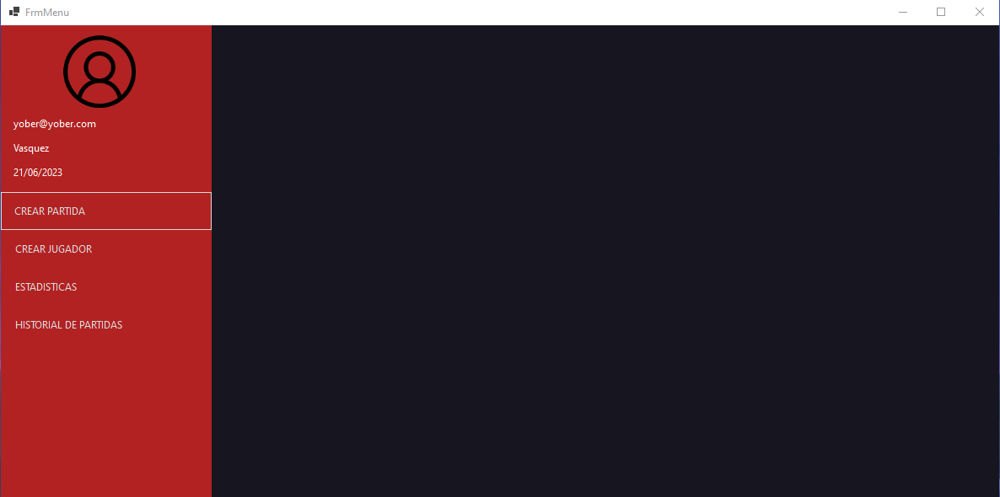
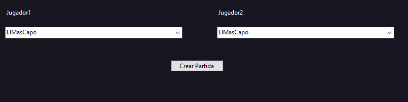
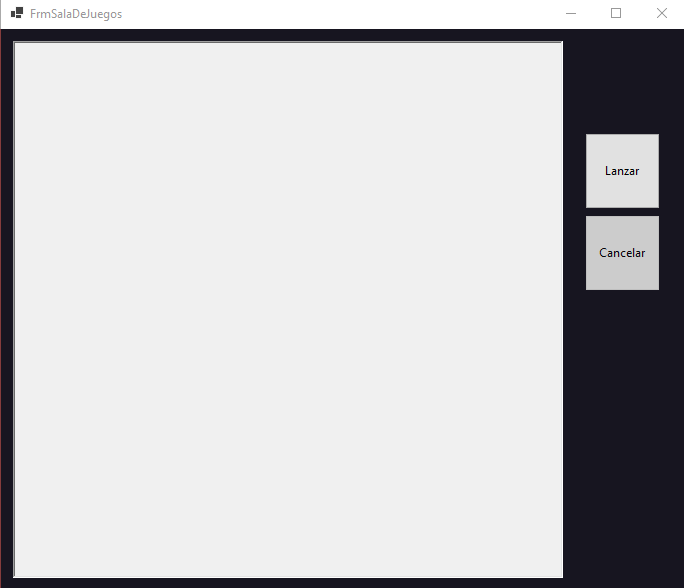
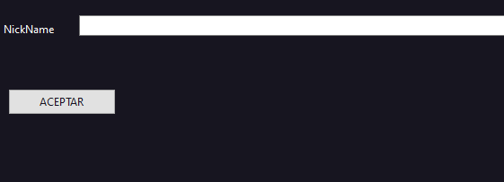
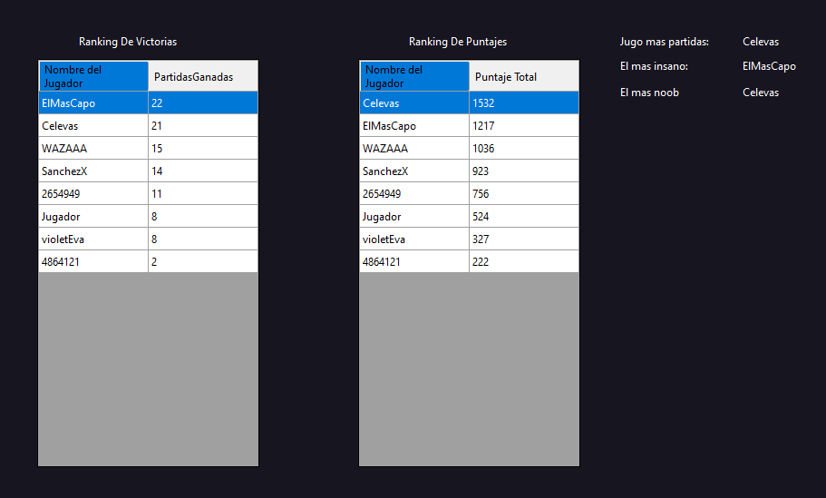
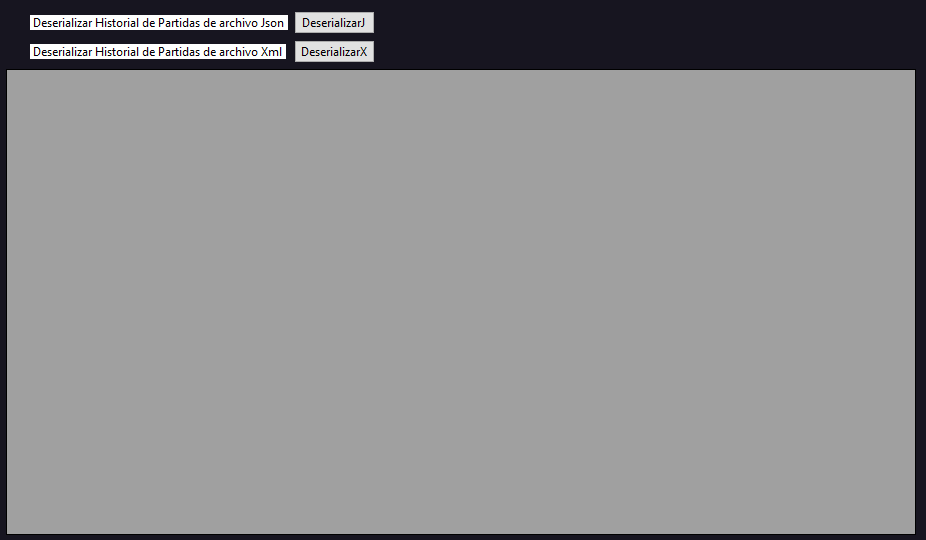
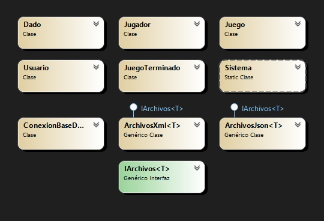

# GENERALA GAME
Mi nombre es Yober Marlow, estudiante de la Tecnicatura en 
Programacion de la UTN. Fue un trabajo muy duro, pero con el tiempo le pude agarrar la mano, me hubiera gustado
poder agregarle mas cosas pero creo que esta bien implementado.
# Formulario de Bienvenida

Formulario de Bienvenida en el cual primero se debe probar la conexion a la base de datos para que los botones de iniciar sesion y crear cuenta de habilite, caso contrario no se habilitan,
luego de eso se podra elegir si iniciar sesion o crearme alguna cuenta.

 # Formulario de Login

Formulario de inicio de sesion, se pediran los datos para poder ingresar al menu principal

 # Formulario de Crear Cuenta

Formulario de creacion de cuenta, se piden datos para poder guardar cuenta en base de datos

 # Formulario del Menu

Formulario de Menu, en dicho formulario nos muestra quien inicion sesion al sistema y estan las opciones para poder trabajar con ellas.

 # Formulario del Crear Partida

Formulario de Crear Partida, se seleccionara los jugadores para poder crear las partidas y se abriga la sala de juegos

 # Formulario del Sala de Juegos

Formulario de Sala De Juego, tiene la opcion de lanzar los dados, son 4 rondas y se puede cancelar en cualquier momento

 # Formulario de Crear Jugador

Formulario de CrearJugador, se podra crear jugadores y estos se guardaran en la base de datos

 # Formulario Estadisticas

Formulario de Estadisticas, se podra visualizar las estadisticas del juego

 # Formulario Historial de Partidas

Formulario de Historial de Partidas, se podra visualizar todas las partidas Jugadas, hasta el momento

# RESUMEN

La aplicacion simula partidas del juego de dados "La generala", se podran crear partidas ilimitadas independientes entre si y mientras se este jugando, se podra visualizar el historial de partidas, estadisticas y etc.
Antes de poder entrar al menu principal, se pedira probar la conexion a la base de datos, si se conecta se inicia sesion y se entra al menu.

# DIAGRAMA DE CLASES

# JUSTIFICACION TECNICA

- SQL: Mi clase ConexionBaseDeDatos conecta a mi base de datos creada en SQL SERVER, donde se guardan los jugadores y mis usuarios.

- Unit Testing: Se testea las jugadas de los dados, la conexion a la base de datos y si se puede crear una sala de juegos.
-  Generics: Se aplica en mi interfaz IArchivos, la clase ArchivosXml y ArchivosJson, los cuales podran manipular cualquier tipo de dato
- Serializacion: Mis clases ArchivosXml y ArchivosJson puede serializar y deserializar archivos(json y xml). Se serializan el historial de partidas, cada vez que termina una partida, estas son serializados y se los deserializa para poder mostrar su contenido.
- Interfaces: IArchivos es una intefaz generica que admite solo clases y fuerza la implementacion de dos metodos, Deserializar y Serializar. Esta podria ser implementada en cualquier clase que manipule entrada y salida de informacion.
- Delegados: Se utilizan dos delegados que reciben un string.
- Task: Al llamar al metodo IniciarJuego() de la clase Juego se iniciara una task ejecutando el metodo Jugar() en un hilo secundario. Esta terminara cuando termine el metodo o sea cancelada por el CancellationToken el cual sera cancelado en un hilo secundario.
- Eventos: Mi clase Juego, tiene dos eventos, ambos al ser invocados envian un mensaje.
- Manejo de excepciones: Se usa excepciones para mostrar mensajes de error al momento de validar datos.

